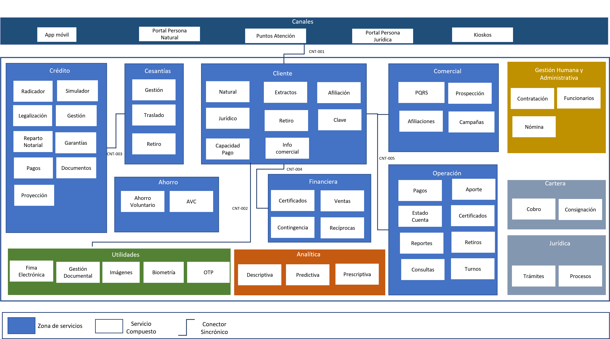
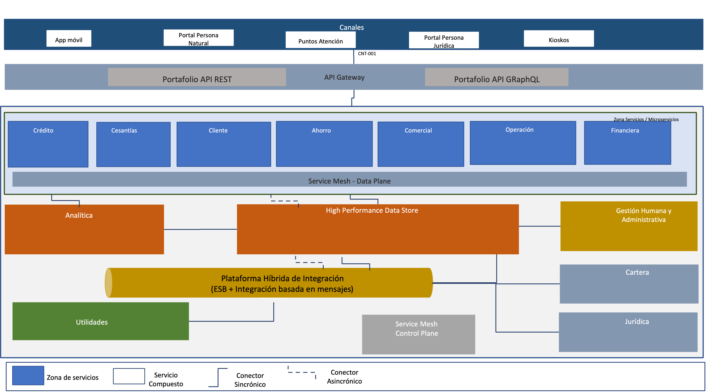
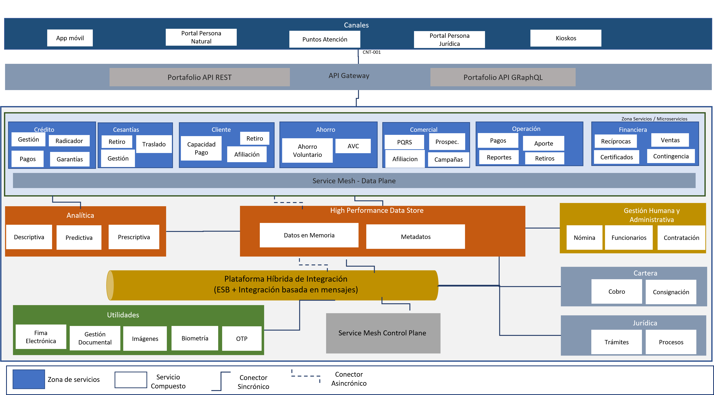
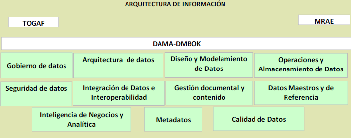
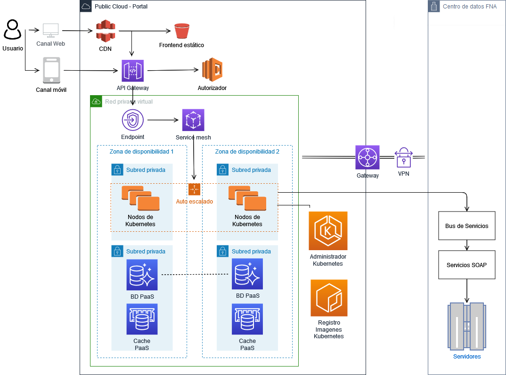

\newpage

| Tema           | $PR12_NOMBRE: **Flujo de trabajo del mantenimiento de la arquitectura de referencia** |
|----------------|----------------------------------------------------------------------|
| Palabras clave | SOA, Arquitectura de referencia, características, dominios, servivios, aplicaciones, datos, |
| Autor          |                                                              |
| Fuente         |                                                              |
| Versión        | **1.$COMMIT** del $FECHA_COMPILACION                         |
| Vínculos       | [Ejecución Plan de Trabajo SOA](onenote:#N001d.sharepoint.com); [Procesos de Negocio FNA](onenote:#N003a.com)|

 

# Diseño y Representación de las Arquitecturas de Referencia 2.0 del FNA
Partimos de la representación de la vista general actual de la arquitecturas del FNA y que implica a las problemáticas diagnósticadas en Fase I @eservices1-22. Sobre este plano realizaremos luego las propuestas de nuevas arquitecturas respecto a la actual dirigidas a enfrentar dichas problemáticas allí planteadas, y que se resumen en las siguientes.

1. Dependencia de proveedor (OBJ1)
1. Fortaleza SOA de las aplicaciones (OBJ2)
1. Tiempo de mercado (OBJ3)

_Fuente: E-Service, Fase I (2022)._

## Dominio de Servicios y Aplicaciones FNA
### Plano General Actual 
El propósito de traer como referencia el plano actual de arquitectura del FNA es recordar dicho esquema  para poderlo comparar con la arquitectura propuesta.

{#fig: width="12in" height="7in"}

 

### Plano General Objetivo
Presentamos la arquitectura de referencia propuesta dividida en dos niveles de detalle.

#### Nivel de detalle 1

{#fig: width="13in" height="7in"}

 

#### Nivel de detalle 2

{#fig: width="13in" height="7in"}

 

## Dominio de Datos FNA
Para la arquitectura SOA objetivo se propone un enfoque conocido como malla de datos. Este paradigma permite pensar en los datos como productos: disponibles y gestionados para su consumo como un producto. La malla de datos introduce cambios organizativos y de procesos que el Fondo Nacional necesitará para gestionar los datos como un activo de capital tangible del negocio.

Una malla de datos tiene como principal objetivo que estos sean más accesibles y estén disponibles para los usuarios, conectando directamente a propietarios, los productores y los consumidores de datos. La malla de datos trae beneficios como la mejora de los resultados empresariales de las soluciones centradas en los datos, y también impulsa la adopción de arquitecturas de datos modernas.

### Pilares de la Malla de Datos (data mesh)
{#fig: width="6in" height="3in"}

### Plano de Datos Objetivo (data mesh)
El desarrollo de la arquitectura candidata de información integrará los marcos de referencia TOGAF, el marco de referencia DAMA y las disposiciones de la política de gobierno digital, en particular las
especificadas por el Marco de Referencia de Arquitectura Empresarial para entidades del Estado Colombiano - MRAE para orientar la evaluación del estado actual y la definición del estado deseado integrando
capacidades para el gobierno de datos, arquitectura de datos, diseño y modelamiento de datos, operaciones y almacenamiento de datos, seguridad de datos, interoperabilidad e integración de datos, gestión documental y contenido, datos maestros y de referencia, inteligencia de negocios y analítica, metadatos y calidad de datos.

{#fig: width="6in" height="3.5in"}

La Ilustración a continuación muestra los marcos de referencia aplicables al dominio de Información:

{#fig: width="6.1375in" height="2.410416666666667in"}

### Características Principales de la Arquitectura de Datos 2.0 del FNA
**Propiedad impulsada por el dominio**: el primer principio de un data
mesh es transferir el poder de los datos y su propiedad a las manos de los equipos de dominio del FNA, es decir a las vicepresidencias y sus departamentos y unidades de negocio. Ellos serán los dueños de los datos de un extremo a otro, y podrán asegurarse de tener desde las fuentes correctas hasta los procesamientos necesarios y la entrega de los datos para que otros equipos de dominio los aprovechen como productos.

**Datos como producto:** los equipos de dominio son responsables de los datos y también de los productos de datos resultantes. El objetivo es lograr que cada "producto de datos" sea descubierto y utilizable por los consumidores y otros equipos de dominio, y el propietario del dominio es responsable de mantener y actualizar (o desaprobar) estos productos para garantizar la calidad y la precisión.

**Infraestructura de autoservicio**: autoservicio es la tendencia a dejar las tecnologías complejas y las
habilidades de nicho. El Data mesh se basa, por principio, en una gestión de datos mediante una plataforma común y un conjunto de herramientas que cualquier equipo de dominio pueda aprovechar.

**Gobernanza federada**: si de verdad debemos eliminar controles de acceso necesitamos un equilibrio entre las políticas y controles de gobernanza global y la posibilidad de dominio y creación de productos. Esto es lo que llamamos gobernanza federada, y en la práctica es fundamental para garantizar la privacidad, el cumplimiento y la posibilidad de escalar.

## Dominio de Infraestructura FNA
Para la arquitectura SOA objetivo se propone un enfoque de computación en la nube donde se hace uso de componentes IaaS y PaaS. Dentro de la oferta actual de componentes se pueden encontrar soluciones que permiten garantizar escalabilidad, disponibilidad, cumplimiento regulatorio y menores tiempos de salida al mercado.

 

### Arquitectura Objetivo
{width="6.1in" height="3.5in"}

 

### Principales Características

**Arquitectura sin servidor para la interfaz web**: Distribución de contenidos con baja latencia y altas velocidades de transferencia usando CDN hospedando el contenido estático de la aplicación en un servicio de almacenamiento de objetos, eliminando la necesidad de utilizar servidores en esta capa.

**Enfoque de microservicios**: Permite obetener capacidad de cómputo particular según sea requerido para soportar la carga. 

**Exposición de la funcionalidad de negocio a través de API Gateway**: Entrega las solicitudes a los microservicios, habilitando la gestión de API para establecer modelos de Calidad en el Servicio (QoS) y controlando la autenticación y autorización.

**Orquestación de contenedores**: Los administradores de Kubernetes permiten automatizar tareas clave como los parches, el aprovisionamiento de nodos y las actualizaciones. El gestior de Kubernetes por lo general permite  gestionar dinámicamente la creación o terminación de nodos y contenedores en base a la demanda.

**Service mesh**: Permite distribuir la carga proveniente de API Gateway, obteniendo mayor visibilidad y controles uniformes del tráfico de red.

**Servicios administrados**: Se aprovechan para elementos tales como la gestión de cache y bases de datos (relaciones y no relacionales). Con esto se evitan  tareas administrativas, como el aprovisionamiento de hardware, parches de software, configuración, ajustes,recuperación de fallos y backups.

**Integración de sistemas**: A través de un enlace Virtual Private Network (VPN) La funcionalidad se expone a través de el Bus de Servicios, habilitando un modelo híbrido de aplicaciones nativas de nube y al mismo tiempo de arquitectura orientada a servicios (SOA).

